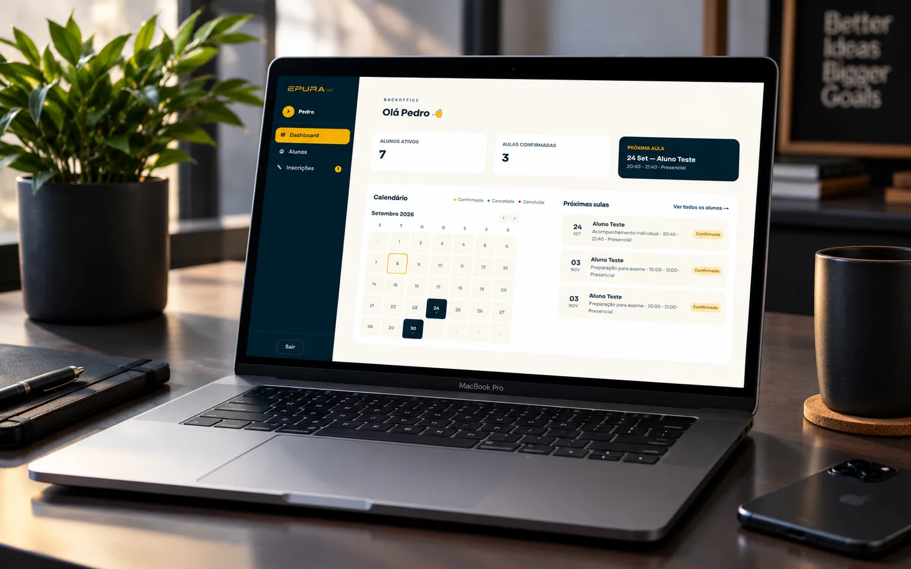
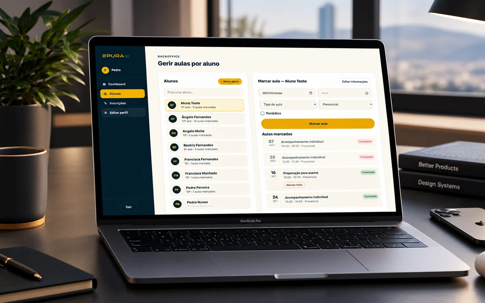
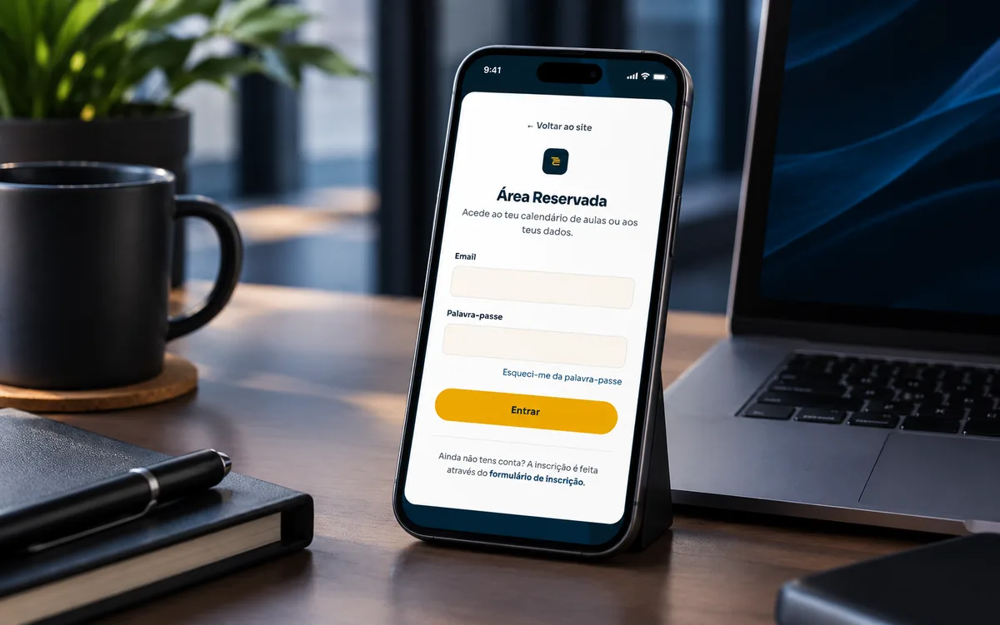

<div align="center">

# Épura
### Fullstack Website + App


<a href="https://epura-explicacoes.pt" target="_blank"></a>

**[🌐 Live Site](https://epura-explicacoes.pt)** · **[📄 Full Case Study](https://angelofdeveloper.github.io/epura-fullstack-website-app/)**

</div>

A fullstack platform I built for a tutoring business: public marketing site,
student portal, and teacher backoffice, shipped as one Next.js + Supabase
codebase that installs as a native-feeling app on iOS and Android — no App
Store involved.

> The production codebase is a private client project, so it isn't in this
> repo. What's here are working, self-contained pieces pulled straight out of
> it — the PWA install flow and the bugs that came with shipping it — with
> client business logic and data stripped out.

## Stack

`Next.js (App Router)` · `TypeScript` · `Supabase` (auth, Postgres, RLS) ·
`Tailwind CSS` · `Resend` (transactional email) · `Web Push` · installable PWA
(manifest + service worker, no build tooling beyond Next.js itself)

## A look inside

<table>
<tr>
<td width="33%"></td>
<td width="33%"></td>
<td width="33%"></td>
</tr>
<tr>
<td align="center"><sub>Teacher backoffice — dashboard</sub></td>
<td align="center"><sub>Backoffice — lessons per student</sub></td>
<td align="center"><sub>Installed PWA — login on iPhone</sub></td>
</tr>
</table>

## What was built

- **Public marketing site** — home, method, services, testimonials, FAQ,
  legal pages, and a booking form that captures student, guardian, and
  billing details in one submission.
- **Student portal** — each student authenticates and sees only their own
  upcoming and past lessons, backed by Supabase Row Level Security, not
  application-level filtering.
- **Teacher backoffice** — full CRUD over students and lessons, a calendar
  view, an incoming sign-up queue.
- **Installable PWA** — the same Next.js app installs on both iOS and
  Android home screens via the browser, with its own icon, no store
  submission.
- **Automated notifications** — booking or cancelling a lesson fires a
  confirmation/cancellation email (Resend) and a push notification
  (Web Push) to the student, in the same request that writes the database
  row.

## Code in this repo

Each file below is self-contained and readable on its own — no shared state
with the rest of the private codebase.

| File | What it's for |
|---|---|
| [`use-pwa-install.ts`](snippets/use-pwa-install.ts) | Detects whether the browser can install the PWA, exposes a single `promptInstall()` call. Handles the iOS-has-no-native-prompt case. |
| [`use-install-banner.ts`](snippets/use-install-banner.ts) | Centralizes install-banner visibility state so a fixed banner and floating action buttons stay in sync instead of duplicating state and drifting apart. |
| [`install-app-banner.tsx`](snippets/install-app-banner.tsx) + [`ios-install-instructions.tsx`](snippets/ios-install-instructions.tsx) | The banner component and its iOS instructions modal — see bug #2 below for the fix baked into this file. |
| [`coming-soon-gate.ts`](snippets/coming-soon-gate.ts) | Middleware gate for pre-launch client review — see bug #1 below, this file *is* the fix. |
| [`sw.js`](snippets/sw.js) | The service worker itself — `fetch` listener, push notification handling, and the `skipWaiting`/`clients.claim` pair that forces a stale cached worker to update. |
| [`pwa-manifest.json`](snippets/pwa-manifest.json) | The web app manifest driving installability — icons, `start_url`, `display: standalone`. |
| [`database-schema.sql`](snippets/database-schema.sql) | Core Postgres schema with Row Level Security — a student's queries can only ever return their own rows, enforced by the database, not application code. |
| [`scroll-snap-carousel.css`](snippets/scroll-snap-carousel.css) | Mobile card carousel built with plain CSS `scroll-snap`, zero JavaScript, zero library. |

## Two production bugs I hit and fixed

### 1. The install prompt never showed up on Android

**Symptom:** manifest valid, icons the right sizes, service worker
registered — and Chrome never offered to install the app, on any Android
device.

**Root cause:** the public domain sat behind a "coming soon" gate for client
review before launch. The middleware enforcing that gate excluded images by
file extension, but not `.js` — so `/sw.js` itself was being redirected for
any visitor without the preview cookie. Service worker registration failed
silently, and without an active service worker Chrome never offers to
install.

**Fix** — see [`coming-soon-gate.ts`](snippets/coming-soon-gate.ts):

```ts
export const config = {
  matcher: [
    "/((?!_next/static|_next/image|favicon.ico|icon|images/|sw.js|manifest.webmanifest|.*\\.(?:svg|png|jpg|jpeg|gif|webp)$).*)",
  ],
};
```

### 2. Installing on iPhone left the banner stuck on screen

**Symptom:** the fixed "Install the app" banner showed up correctly on iOS,
but tapping Install made it vanish instantly — without ever showing the
"Add to Home Screen" instructions Safari requires (there's no native PWA
install prompt on iOS).

**Root cause:** the click handler dismissed the banner unconditionally, even
on the branch that was only supposed to open the instructions modal. The
banner disappeared in the same render pass as the modal — which lived inside
the same component — so the modal never actually got a chance to be seen.

**Fix** — see [`install-app-banner.tsx`](snippets/install-app-banner.tsx):

```tsx
// before: dismissed on both branches
function handleInstall() {
  if (hasNativePrompt) promptInstall();
  else if (isIOS) setShowIOSInstructions(true);
  dismiss(); // ← ran every time, killed the modal it just opened
}

// after: only dismiss once the native prompt actually fired
function handleInstall() {
  if (hasNativePrompt) {
    promptInstall();
    dismiss();
  } else if (isIOS) {
    setShowIOSInstructions(true);
  }
}
```

---

Built by [Ângelo Fernandes](https://www.linkedin.com/in/angeloxfernandes) — [Ângelo Studio](https://angelostudio.pt).
